 

 

Computer Science Engineering student at DSCE, Bengaluru — building at the intersection of AI, design, and full-stack engineering. Currently deepening DSA, system design, and shipping AI-powered products end to end.

 

### Contribution snake

<picture>
  <source media="(prefers-color-scheme: dark)" srcset="./assets/snake-dark.svg" />
  <source media="(prefers-color-scheme: light)" srcset="./assets/snake-light.svg" />
  
</picture>

 

### Stats

generated once a day by a GitHub Action and committed as real files — not a live third-party call, so it can't go down or rate-limit.

 

### Tech

 

<a href="https://github.com/mallya-m">GitHub</a> ·
<a href="https://linkedin.com/in/mallya-moni">LinkedIn</a> ·
<a href="mailto:mallyamoni035@gmail.com">Email</a>

